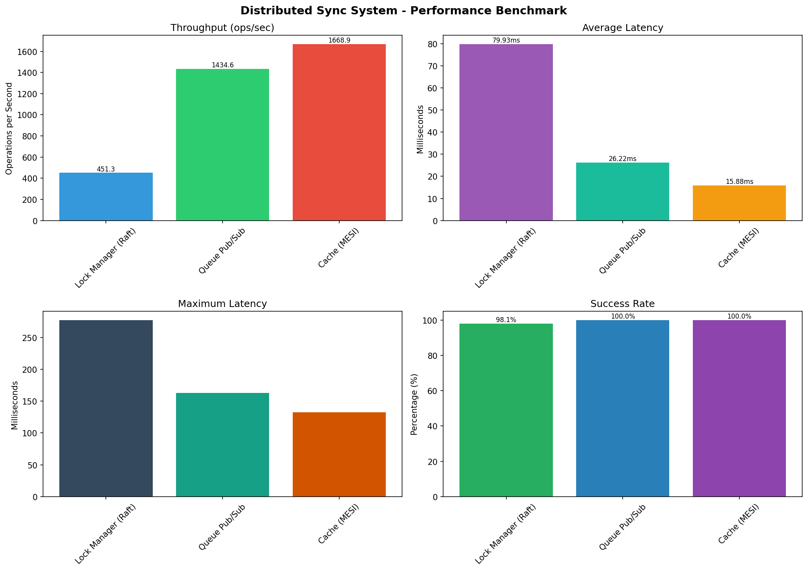

# Sistem Sinkronisasi Terdistribusi (Distributed Sync System)

Repositori ini berisi implementasi Sistem Sinkronisasi Terdistribusi yang dikembangkan untuk memenuhi Tugas Mata Kuliah **Sistem Paralel dan Terdistribusi**.

Sistem ini mensimulasikan lingkungan *distributed cluster* peer-to-peer tanpa *Single Point of Failure*, dan dirancang menggunakan Python `asyncio`.

---

## 🌟 Fitur & Algoritma Utama
Sistem ini mengimplementasikan 4 konsep primitif terdistribusi secara *from scratch*:
1. **Raft Consensus & Lock Manager:** Memastikan pemilihan Leader yang tangguh, replikasi log, dan menyediakan *Distributed Lock* (`SHARED` & `EXCLUSIVE`) yang aman dari deadlock.
2. **Distributed Message Queue:** Menerapkan algoritma *Consistent Hashing* (dengan Virtual Nodes) untuk mendistribusikan topik antrean ke seluruh node, mendukung skenario *Pub/Sub*.
3. **Cache Coherence (MESI):** Menjaga konsistensi data *cache* antar node menggunakan protokol MESI dengan kebijakan pembuangan data (Replacement Policy) *Least Recently Used (LRU)*.
4. **Failure Detector (SWIM-like):** Node secara aktif saling mengirim sinyal *Heartbeat* untuk mendeteksi *crash* dan memicu *recovery/failover* otomatis.

---

## 📂 Struktur Dokumentasi (Wajib Baca)
Penjelasan mendalam tentang arsitektur, API, dan performa sistem bisa ditemukan di dalam folder `docs/`:
- 📐 [Arsitektur Sistem (architecture.md)](./docs/architecture.md)
- 🔌 [Spesifikasi API (api_spec.yaml)](./docs/api_spec.yaml)
- 🚀 [Panduan Deployment (deployment_guide.md)](./docs/deployment_guide.md)

---

## 🛠️ Instalasi & Penggunaan

### 1. Menjalankan via Docker (Direkomendasikan)
Cara termudah untuk menyalakan kluster 3 Node:
```bash
cd docker
docker-compose up --build
```

### 2. Menjalankan via Terminal (Manual / Debugging)
Install library yang dibutuhkan:
```bash
pip install -r requirements.txt
```
Lalu buka 3 terminal terpisah dan jalankan:
```bash
python -m src.nodes.__main__ --node-id node_1 --port 8001
python -m src.nodes.__main__ --node-id node_2 --port 8002
python -m src.nodes.__main__ --node-id node_3 --port 8003
```

### 3. Simulasi & Benchmarking
Untuk melihat simulasi 8 fitur beraksi:
```bash
python test_sequence.py
```
Untuk menguji beban (Load Testing) dan menghasilkan grafik performa:
```bash
python benchmarks/load_test_scenarios.py
python visualize_results.py results.json
```

**Hasil Benchmarking Sistem:**


---

## 📹 Video Demonstrasi
Silakan tonton demonstrasi *live* dari sistem ini di YouTube:
**[LINK VIDEO YOUTUBE AKAN DITARUH DI SINI]**